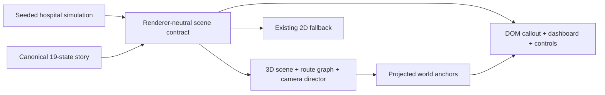

# Hospital Sim V2 — True 3D Operating Twin

Planning baseline · 2026-07-16

## Executive recommendation

Build a true 3D **living architectural model** of one hospital campus—not a hospital-themed game and not a more elaborate background image.

The experience should combine:

- the spatial legibility of SimCity;
- the process credibility of FlexSim;
- the camera restraint of an executive keynote; and
- the deterministic causal story already working in this application.

The central visual thesis is:

> **The building stays the same. AI changes the operating rules. The constraint moves.**

The guided presentation remains the primary product. An optional explore mode can follow the story, but it must never compromise the presenter-controlled 19-state sequence.

### Recommended technical direction

Use **React Three Fiber on Three.js/WebGL2** inside the current React application. Keep the simulation, storyboard, controls, callouts, dashboard, and accessibility layer in React/DOM. Replace only the spatial renderer.

For the conference build, create the complete hospital as a stylized procedural graybox with reusable low-poly actors. This removes a 3D-art bottleneck while delivering genuine depth, occlusion, lighting, floor plans, camera movement, and world-space routes. Replace selected modules with Blender-authored GLB assets after the spatial and narrative system passes its first release gates.

Do not make WebGPU, physics, unrestricted orbit controls, post-processing, or photorealism dependencies of the first release.

## The experience we are building

The audience looks into an open-sided hospital campus from a consistent three-quarter perspective. Roads, parking, the arrival loop, EMS access, rooms, corridors, equipment, beds, and people occupy real world-space coordinates. The front shell is absent and floor plates are slightly separated, so the whole operating system can be understood at a glance.

The scene is not a literal facility design. It is an illustrative operating twin that makes flow, queues, handoffs, and capacity decisions visible.

### What qualifies as true 3D

V2 is not complete unless it has all of the following:

1. Perspective or orthographic 3D geometry with real depth, lighting, elevation, and occlusion.
2. A camera that moves between authored world-space poses.
3. Vehicles and people that follow road, sidewalk, corridor, and portal routes in world space.
4. An open-sided building shell exposing actual floor plates and rooms.
5. Callout leaders projected from named 3D anchors into accessible DOM overlays.
6. Responsive camera compositions rather than crops of one desktop frame.
7. Deterministic state: the same story state produces the same camera, actors, metrics, and operating condition every time.

### Product doctrine

- **One hospital, one moving constraint.** The six levers are not separate product demos.
- **Operations before annotation.** A queue, idle room, occupied bed, rework loop, or task pile becomes visible before the callout explains it.
- **The camera is the narrator.** It moves once, only when the next pressure is revealed.
- **Improvement changes dwell and flow—not walking speed.** People do not move faster merely to imply AI performance.
- **Realism serves comprehension.** The scene is an architectural maquette, not a game or a facility replica.
- **The final beat is a decision.** AI does not “solve the hospital”; it exposes staffed recovery capacity as the next investable constraint.

## Operational coverage contract

Every component below must be recognizable, visible from at least one canonical camera, represented in the DOM semantic layer, and connected to a route or operating-state change.

| Domain | Required 3D components | Required operating behavior |
|---|---|---|
| Campus | Hospital shell, open floor plates, roads, sidewalks, parking stalls, parked cars | Stable spatial frame; campus remains recognizable from every shot |
| Parking and arrivals | Arrival road, departure road, parking aisle, valet canopy, curb, main doors | Cars arrive, queue, hand off, park, and depart on separate routes |
| Patient access | Lobby, registration/access point, waiting positions | Arriving context is missing at baseline and precedes the patient after Digital Front Door |
| EMS | Dedicated approach, ambulance bay, ED entry | Ambulance arrival, unload hold, and ED handoff |
| Diagnostics | CT room, MRI room, waiting positions, routing decision point | Scanner cycle, queue, and avoidable rework loop |
| Precision planning | Planning room/workstation between diagnosis and readiness | Patient-specific context attaches before the plan locks |
| Pre-op/readiness | Pre-op bays, readiness board, gurney queue | Missing prerequisites create dwell and plan revisions |
| Surgical core | At least two visible robotic ORs, robot, sterile core, instrument staging | Team, room, instruments, and turnover can be visibly synchronized |
| Recovery | PACU bays and explicit occupancy states | Bed turnover, queue transfer, and full-capacity condition |
| Inpatient care | Bed tower/floor, caregivers, patients, discharge readiness | Bed occupancy and caregiver movement remain visible but subordinate |
| Discharge | Discharge lounge/exit and transport pickup | Named next step exists before the patient leaves |
| Longitudinal care | Off-campus home/virtual-care node and escalation path | Owned follow-up path extends beyond the building envelope |
| Task automation | Cross-campus task network and human approval gates | Routine task tokens move between systems; consequential decisions stop at people |
| Entities | Cars, ambulance, valets, EMS, patients, caregivers, gurneys, beds, imaging equipment, robot, instrument carts | Each moving entity follows an authored route and meaningful work sequence |
| Evidence | One active spatial pressure, one callout, one local receipt, mini-dashboard | Callout, camera, scene condition, and metrics stay semantically aligned |

### Representative-count rule

The simulated model currently contains four robotic servers and 20 care servers. The scene must either depict those counts or explicitly label visible rooms and beds as representative. Visible actors are flow tokens, not a literal census or staffing model.

## Spatial design

Use one persistent southwest-facing campus so the audience forms a stable mental map.

```text
Campus
├── South/front: parking → valet → patient arrivals → access lobby
├── West/left: EMS road → ambulance bay → ED
├── Upper west: CT/MRI → diagnostic routing
├── Center: precision planning → pre-op readiness
├── Center/east: sterile core → robotic ORs
├── East: PACU → inpatient beds → discharge lounge
└── Beyond east: longitudinal/home-care node
```

### Floor strategy

Use three slightly separated clinical plates above the campus plane:

1. **Arrival and diagnostic plate** — access, ED, CT, MRI, planning.
2. **Procedural plate** — pre-op, sterile core, robotic ORs, PACU.
3. **Care and continuity plate** — staffed beds, discharge lounge, navigation.

The open-sided shell is authored into the geometry. Avoid relying on runtime clipping planes for the main cutaway: they introduce transparency artifacts, composition surprises, and avoidable GPU cost.

Task Automation is not a room. It is a logical layer spanning the hospital. Digital Front Door and Longitudinal Care visibly extend beyond the building envelope.

### Visual language

- Neutral warm-gray architecture with slightly warm interior light.
- Darker campus ground and restrained material palette.
- One lever color at a time; nonfocus zones desaturate and dim slightly.
- Baked or vertex ambient occlusion to reveal room depth.
- One directional key light and one hemisphere/ambient light.
- Limited real-time shadows; no post-processing in the first release.
- No 3D body text. Executive typography remains crisp in the DOM.

## Narrative and camera contract

Preserve the existing causal order exactly:

**Digital Front Door → Clinical Diagnosis → Precision Medicine → Robotics → Longitudinal Care → Task Automation**

The current 19 canonical states remain the source of truth:

- one opening `surface` state;
- six `materialize → resolve → reveal` cycles;
- simulation metrics frozen during `materialize`;
- the lever committed once on entry to `resolve`;
- the camera held through `materialize` and `resolve`;
- exactly one camera move on `reveal`;
- a 123.6-second unattended run.

### Camera grammar

- Use an orthographic or very shallow-perspective architectural camera.
- Maintain a consistent azimuth; change target and distance more than angle.
- No roll, spinning, fly-through, or first-person movement.
- Guided mode locks orbit and scene selection.
- The active zone lands inside the central 60% of the canvas.
- Target movement duration: 1.2–1.6 seconds with smooth acceleration/deceleration.
- Callout appears only after the target is settled and visible.
- Preserve the 800 ms visual exhale between resolution and the next emphasis.

### Suggested shot rail

1. Campus/access overview.
2. Imaging and diagnosis.
3. Precision planning and pre-op readiness.
4. Robotic OR and sterile core.
5. PACU, beds, and discharge.
6. Discharge-to-home longitudinal path.
7. Elevated whole-campus task layer.
8. Recovery capacity as the final investment decision.

### Six-lever choreography

| Lever | Pressure made physical | AI mechanism made visible | Resolve receipt | Next pressure revealed |
|---|---|---|---|---|
| Digital Front Door | Cars and patients accumulate; intake context visibly resets | A persistent context ribbon reaches access before the patient | Access wait decreases; arrival queue releases naturally | Imaging/diagnosis absorbs released demand |
| Clinical Diagnosis | Diagnostic waiting positions fill; an avoidable rework loop returns tokens | Pathway intelligence selects the correct downstream route | Diagnostic wait decreases; wrong-way loop disappears | Pre-op readiness becomes the queue |
| Precision Medicine | Gurneys wait on incomplete prerequisites; plan-revision token returns upstream | Patient-specific clinical/molecular context attaches before plan lock | Readiness peak queue decreases | OR capacity becomes visible |
| Robotics | Robot and room sit ready while team/instruments/turnover remain unsynchronized | Team, room, instrument cart, and turnover states synchronize | OR completions increase | Recovery/discharge absorbs released capacity |
| Longitudinal Care | PACU/bed occupancy persists because the next step has no owner | An owned path connects bed, discharge, transport, home, and escalation | Follow-up wait decreases | Administrative work becomes visible |
| Task Automation | Routine task tokens pile across disconnected systems; caregivers backtrack | Agents carry routine work through named human approval gates | Administrative touches decrease | Staffed recovery capacity becomes explicit |

### Constraint visualization hierarchy

1. **Physical evidence** — an accumulated queue, idle robot, full beds, or task pile.
2. **Spatial emphasis** — a restrained amber/coral zone outline or floor field.
3. **Executive callout** — one proposition, one metric, one leader line.

State semantics remain stable:

- pressure: amber accumulation;
- system constraint: coral zone outline plus physical queue;
- AI materializing: lever-colored path appears while performance holds;
- resolved: mint operating receipt and natural queue release;
- reveal: prior emphasis clears, camera moves once, next coral pressure appears.

## Entity and flow design

The current 14 route families become a typed world-space route graph:

1. car arrival;
2. car departure;
3. car parking;
4. ambulance approach;
5. valet curb;
6. valet entry;
7. patient arrival;
8. patient ward;
9. caregiver prep;
10. caregiver OR;
11. caregiver recovery;
12. caregiver ward;
13. gurney prep-to-OR;
14. gurney OR-to-recovery.

Add instrument-cart and discharge-to-home routes once the original 14 pass.

### Movement rules

- Vehicles sample road splines and orient to the path tangent.
- Valets and pedestrians use sidewalk/corridor lanes and authored queue slots.
- Gurneys use corridors and portal/elevator transitions.
- Caregivers move between meaningful work points, not decorative loops.
- Instrument carts connect sterile staging to the correct OR.
- Spawn and despawn occur only at named portals.
- Actors follow `spawn → queue → service → handoff → exit`.
- Identical demand and spawn cadence replay across before/after scenarios.
- Interventions change dwell, exception, routing, rework, occupancy, and queue length—not actor speed.

### Density target

- Conference desktop: 30–36 visible representative entities at peak.
- Definitive desktop: 44–60 visible representatives after performance proof.
- Conference mobile: 10–14 visible representatives; definitive mobile: 20–28 where the device tier sustains the target.
- The system may model more tokens than it renders; density is a visual sample, not a census.

## Interaction model

### Guided mode — primary executive demo

- Locked canonical story and camera rail.
- Run/Pause, Back, Next, Replay Cycle, Reset, Stage View.
- Space toggles play; arrow keys step; `R` replays; `S` toggles stage mode.
- Scene picking is disabled except for the current callout.
- Pausing freezes the story clock, camera, equipment, and actor world state.

### Explore mode — post-story

- Constrained orbit around the same hospital, never free flight.
- Named zone hotspots and authored camera presets.
- Inspect queue, capacity, lever, and assumptions for one zone at a time.
- Arbitrary lever combinations belong here, not in the guided story.
- “Return to guided story” restores the exact canonical state.

Explore mode is a post-conference enhancement unless the guided build is already release-safe.

## Presenter composition

Keep executive text outside WebGL:

- 72–76%: 3D hospital scene;
- 10–12%: mini-dashboard strip;
- 12–16%: assertion caption;
- one callout in a pre-authored safe quadrant;
- one world-to-screen leader from the active anchor;
- no metric or control may overlap the callout.

The mini-dashboard shows only:

1. current constraint;
2. active local receipt;
3. flow yield;
4. median journey or administrative touches, whichever explains the beat.

On resolve, the local before→after receipt becomes primary and the other metrics remain contextual.

## Technical architecture

The renderer changes. The operating logic does not.



### Engine decision

Use React Three Fiber + Three.js because it:

- fits the current React 19 state architecture;
- lets the 3D tree respond declaratively to the existing story model;
- supports lazy loading and a graphics-context fallback;
- gives direct access to Three.js renderer metrics and asset loaders;
- supports instanced geometry for repeated actors and equipment.

Use WebGL2 as the baseline. WebGPU remains an experiment after release, not a launch dependency.

### Proposed module boundaries

```text
src/
  components/
    HospitalTwin.tsx                  # canonical story owner; retained
    HospitalExperience.tsx            # renderer-neutral frame
    HospitalCutaway2D.tsx             # current cutaway; fallback
    hospital-3d/
      HospitalScene3D.tsx             # lazy Canvas and error boundary
      HospitalWorld.tsx               # scene graph root
      HospitalShell.tsx               # campus, plates, rooms
      HospitalProps.tsx               # static equipment and furniture
      HospitalActors.tsx              # pooled/instanced entities
      RouteDirector.tsx               # spline sampling and dwell
      CameraDirector.tsx              # reveal-only motion
      StoryEffects.tsx                # pressure/solution/receipt visuals
      QualityGovernor.tsx             # DPR, LOD, density tier
      ProjectedAnchors.tsx            # world-to-DOM bridge
  lib/
    hospital-story.ts                 # unchanged canonical contract
    hospital-storyboard.ts            # unchanged theses and pressures
    hospital-sim.ts                   # aggregate source of truth
    hospital-flow-trace.ts            # deterministic event trace
    hospital-scene-model.ts           # renderer-neutral adapter
    hospital-scene-contract.ts        # typed 3D scene input
  data/
    hospital-world-v2.json            # zones, anchors, cameras, routes
    hospital-asset-manifest.json      # asset IDs, LODs, budgets
  assets/generated/hospital-3d/
    hospital-campus-high.glb
    hospital-campus-low.glb
    hospital-props.glb
    hospital-actors.glb
assets-source/hospital-3d/
  hospital-v2.blend
  README.md
scripts/
  check-hospital-3d-contract.mjs
  check-hospital-3d-assets.mjs
  browser-hospital-3d-evaluator.mjs
```

### Renderer-neutral scene contract

```ts
type HospitalSceneContract = {
  stateId: HospitalStoryStateId;
  beat: HospitalStoryBeat;
  activeLevers: LeverId[];
  materializingLever?: LeverId;
  pressureId: HospitalPressureId;
  focusZoneId: HospitalZoneId;
  focusAnchorId: WorldAnchorId;
  cameraPoseId: CameraPoseId;
  before: SimulationResult;
  current: SimulationResult;
  motionMode: "playing" | "paused" | "reduced";
};
```

Both the 2D and 3D renderers consume this contract during migration. This is the control point that prevents the 3D build from creating a second story engine.

### World manifest contract

Each zone, route, portal, queue slot, and camera is data—not an untracked mesh position.

```ts
type WorldPoint = { x: number; y: number; z: number };

type HospitalZone = {
  id: HospitalZoneId;
  stageId?: StageId;
  bounds: { min: WorldPoint; max: WorldPoint };
  anchorId: WorldAnchorId;
  cameraPoseId: CameraPoseId;
  visibleComponentIds: string[];
};

type HospitalRoute = {
  id: string;
  surface: "road" | "sidewalk" | "corridor" | "portal";
  actorKinds: string[];
  points: WorldPoint[];
  queueSlotIds: string[];
  speedMetersPerSecond: [number, number];
};
```

### Simulation-to-motion bridge

Extend the deterministic simulation with an optional event trace:

```ts
type SimulationEvent = {
  episodeId: number;
  cohort: "routineSurgery" | "precisionSurgery" | "medical";
  stageId: StageId;
  readyTime: number;
  startTime: number;
  finishTime: number;
  exception: boolean;
};
```

Do not render 600 literal patients. Representative tokens derive queue occupancy, dwell, rework, and completion cadence from the trace. On `resolve`, the visual world switches exactly once from the before trace to the after trace.

## Asset and rendering strategy

### Conference path

- Generate the campus shell, floors, rooms, roads, beds, queues, and simple equipment from TypeScript primitives.
- Create low-poly people, cars, ambulance, gurneys, carts, scanners, and robot as reusable mesh groups.
- Use instancing for repeated geometry.
- Store all dimensions and semantic IDs in the world manifest.
- Validate the system before investing in bespoke art.

### Production path

- Author modular replacements in Blender; one Blender unit equals one meter.
- Export GLB with stable semantic node names and custom properties.
- Keep shell, props, and actors separate so they can load and version independently.
- Use a shared material atlas and explicit high/low variants.
- Use Meshopt geometry compression; add KTX2 textures only after decoder paths are proven.
- Bundle assets and decoders with the application; no live-presentation CDN dependency.
- Validate GLB extensions, node names, triangle count, texture sizes, and budgets in CI.

Example node names:

```text
ZONE_DIAGNOSTICS
ANCHOR_PRESSURE_DIAGNOSIS
PATH_AMBULANCE_01
PROP_BED
CAMERA_ROBOTICS
```

### Initial design budgets

These are gates to prove in the engine spike, not current claims.

| Budget | Desktop target | Mobile target |
|---|---:|---:|
| Visible triangles | ≤350k hard; pursue ≤120k | ≤200k hard; pursue ≤60k |
| Draw calls | ≤150 hard; pursue <80 | pursue <50 |
| Initial compressed 3D transfer | ≤5 MB hard; pursue <3 MB | ≤3.5 MB hard; pursue <1.5 MB |
| Total scene transfer | ≤12 MB | reduced asset tier |
| Maximum texture dimension | 2048 px hard; pursue 1024 px | 1024 px hard; pursue 512 px |
| Device pixel ratio | adaptive, approximately 1.25–1.5 | approximately 1.0 |
| Desktop p95 frame time | ≤18.2 ms | — |
| Mobile p95 frame time | — | ≤33.3 ms |

The 3D renderer is lazy-loaded only when the hospital-twin chapter mounts. Story-critical assets and shaders are ready before Run is enabled.

## Mobile, accessibility, and failure modes

### Mobile is a separate composition

- Use authored portrait camera poses for every canonical state.
- Canvas occupies roughly the upper 58–62% of the viewport.
- Place the callout, receipt, and compact controls in a bottom sheet.
- Remove in-scene callout cards; retain the world anchor as a visual target.
- Use a 2×2 metric arrangement with no horizontal scroll.
- Disable orbit in guided mode.
- Cap DPR, reduce shadow quality, lower actor density, and pause when hidden.

### Reduced motion

- Freeze ambient actors and equipment.
- Replace camera travel with a ≤50 ms cut.
- Preserve all 19 pressures, interventions, receipts, metrics, and semantic summaries.
- Offer an explicit “Show flow” control rather than automatic motion.

### Parallel semantic layer

The canvas has a state-specific DOM description containing:

1. the current pressure or intervention;
2. the active hospital zone;
3. what visibly changed;
4. the before/after metric;
5. the operating implication.

Controls remain ordinary DOM elements. The live region updates once per story state, never per animation frame.

### Fallback ladder

1. Full 3D — desktop/tablet quality tier.
2. Reduced 3D — low LOD, capped DPR, simplified materials, fewer representatives.
3. Existing 2D cutaway — WebGL2 unavailable, context loss, asset failure, or explicit safe mode.
4. Pre-rendered guided video — stage emergency backup.

All fallbacks preserve the current canonical state and committed levers. Failure must never produce a blank centerpiece.

## Delivery plan

### Track A — conference MVP

The smallest credible conference version is a complete stylized 3D system, not a polished partial hospital.

| Day | Outcome | Exit test |
|---|---|---|
| 1 | Engine spike, lazy canvas, procedural campus shell, orthographic camera, renderer-neutral adapter, 2D fallback | Loads on the presentation laptop; all 19 states can select a camera pose |
| 2 | All operational zones and exterior components; named anchors; full route graph | Coverage manifest is complete; no required zone is missing |
| 3 | Instanced actors, queue slots, route adherence, physical constraint states | All 14 inherited routes run without wall/floor violations |
| 4 | Six AI mechanisms, projected callout tether, dashboard integration, desktop and portrait compositions | Every canonical state aligns camera, scene, callout, and metric |
| 5 | Performance tuning, reduced motion, fault fallback, full rehearsal and captures | Five clean full runs on exact stage hardware; fallback drill succeeds |

Conference cuts:

- no unrestricted explore mode;
- no photoreal materials;
- no physics engine;
- no day/night, weather, construction, or crowd simulation;
- no scenario sliders in guided mode;
- no WebGPU dependency;
- no runtime wall slicing;
- no bespoke animation beyond the robot, scanner, doors, and meaningful handoffs.

If the engine spike misses narrative or frame-time gates, keep the current 2D twin as the live version and present the 3D slice only as a preview. Do not let sunk art effort force a risky stage decision.

The conference release decision becomes binary at the end of Day 3: if the graybox cannot depict every component, keep all 19 states aligned, and sustain the native presentation-laptop frame-time target, V1 remains the live demo.

### Track B — definitive V2

| Phase | Deliverable | Estimate |
|---|---|---:|
| 0. Contract freeze and engine spike | Renderer adapter, one world, all camera states, fallback, real hardware measurement | 2–3 person-days |
| 1. Complete graybox hospital | All zones/components, routes, representative actors, projected anchors | 4–6 person-days |
| 2. Production asset pass | Modular Blender kit, equipment, materials, high/low GLBs, compression | 6–9 person-days |
| 3. Simulation-coupled flow | Event trace, queue/dwell mapping, deterministic before/after replay | 4–6 person-days |
| 4. Adaptive quality and inclusion | Mobile, LOD/DPR governor, reduced motion, recovery, 2D fallback | 3–4 person-days |
| 5. Release evaluation | 114-state composition, native GPU tests, physical devices, human study, stage rehearsal | 3–5 person-days |

Total: approximately 22–33 person-days. A frontend engineer and 3D artist working in parallel can produce a strong vertical slice in one week; the fully polished and release-gated version is a two-to-three-week build.

## Evaluation and instrumentation plan

V2 extends the current standard rather than replacing it. Keep all existing narrative, layout, performance, accessibility, reliability, and audience gates.

Add a deterministic debug surface such as `window.__hospital3dDebug` exposing:

- canonical state and world-state hash;
- camera pose and transition count;
- visible zone/component IDs;
- actor transforms, route IDs, and queue slots;
- projected anchor and target rectangles;
- renderer draw calls, triangles, textures, and frame-time samples;
- asset readiness and fallback tier.

Automated tests should capture all 19 states at all six existing viewports, validate the scene/topology manifest, replay known flow seeds, trace actors at 10 Hz, inspect projected anchors, inject context loss, and build a current evidence record from source and asset hashes.

The detailed draft gate catalog lives in [`../evals/hospital-v2-release-standard.draft.json`](../evals/hospital-v2-release-standard.draft.json).

## Claim discipline

Because 3D realism can imply false specificity, keep this visible and persistent:

> Illustrative operating twin—not a facility design or clinical recommendation.

Additional rules:

- Every number is a simulation input, derived output, or clearly labeled hypothesis.
- “System constraint” always matches the model-selected constraint.
- Visible entity counts are described as visualization scale, not census or staffing.
- No clinical-outcome, safety, staffing, code-compliance, or autonomous-surgery implication without evidence.
- Surgical judgment remains explicitly human-led.
- Model version, seed, horizon, and assumptions remain available through “About this twin.”

## Decision gates before production art

Do not begin the Blender production pass until a procedural vertical slice proves:

1. The whole campus is understandable within five seconds.
2. The active zone is understood within three seconds.
3. All 19 states preserve the exact causal timing.
4. The camera never competes with the proposition.
5. World-space routes remain attached to roads, floors, corridors, and portals.
6. The presentation laptop meets the desktop frame-time budget.
7. Portrait mobile remains legible and stable.
8. Context loss and asset failure return to the 2D fallback.
9. Uncoached viewers can say: “AI moved the constraint and made the next decision visible.”

## First build brief

The first implementation should be a two-day technical vertical slice:

- a procedural three-floor hospital shell;
- parking, valet, EMS, lobby, imaging, pre-op, two ORs, PACU, beds, discharge, and home-care node;
- one car, ambulance, patient, caregiver, gurney, and instrument-cart route;
- all seven pressure anchors and eight camera poses;
- the complete 19-state scene adapter;
- current DOM callout, dashboard, controls, and live region;
- full 3D, reduced 3D, and 2D fallback modes;
- measurement on the actual presentation laptop.

That slice answers the only decision that matters before production: **does true 3D increase spatial-system understanding without weakening the argument?**

## References

- [React Three Fiber Canvas and fallbacks](https://r3f.docs.pmnd.rs/api/canvas)
- [React Three Fiber performance scaling](https://r3f.docs.pmnd.rs/advanced/scaling-performance)
- [Three.js WebGLRenderer](https://threejs.org/docs/pages/WebGLRenderer.html)
- [Three.js GLTFLoader](https://threejs.org/docs/pages/GLTFLoader.html)
- [Khronos glTF](https://www.khronos.org/gltf/)
